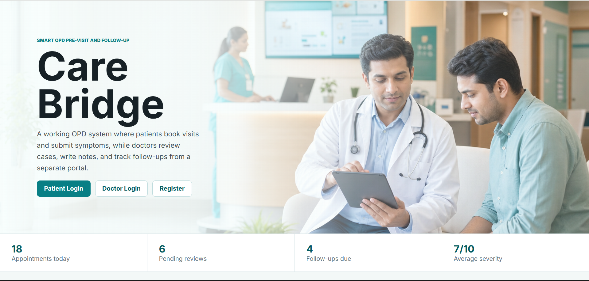

# CareBridge – Smart OPD Pre-Visit & Follow-Up Web Portal

CareBridge is a healthcare web application designed to improve communication between patients and healthcare providers before and after OPD visits.

The platform helps patients submit symptoms, appointment details, and medical information before consultations, while enabling doctors to review patient data and provide timely follow-up recommendations.

## Problem Statement

Many healthcare facilities face challenges in managing patient information before appointments and maintaining effective follow-up communication after consultations.

Patients often forget appointments, fail to provide complete medical information, and miss important post-visit instructions.

CareBridge addresses these challenges by providing a centralized digital platform for appointment management, symptom reporting, and patient follow-up.

## Features

### Patient Module

* Patient Registration and Login
* Symptom Submission
* Appointment Tracking
* Follow-Up Notifications
* Medical History Management
* Profile Management

### Doctor Module

* Patient Record Review
* Appointment Management
* Follow-Up Recommendations
* Doctor Notes Management
* Patient Monitoring Dashboard

### System Features

* OPD Pre-Visit Information Collection
* Follow-Up Management
* Notification System
* Medical Report Tracking
* Secure Data Storage

## Technology Stack

### Frontend

* HTML5
* CSS3
* JavaScript

### Backend

* Node.js

### Database

* JSON Data Storage

### Development Tools

* Visual Studio Code
* Git
* GitHub

## Project Structure

```text
CareBridge/
├── assets/
├── data/
├── app.js
├── index.html
├── styles.css
├── server.js
└── package.json
```

## Application Screenshots

### Dashboard

(Add Dashboard Screenshot)

### Patient Profile

(Add Patient Profile Screenshot)

### Appointment Management

(Add Appointment Screenshot)

### Follow-Up System

(Add Follow-Up Screenshot)

## Future Enhancements

* Firebase Integration
* Real-Time Notifications
* SMS and Email Alerts
* Electronic Health Records Integration
* AI-Based Health Recommendations
* Online Appointment Scheduling

## Project Objective

The primary objective of CareBridge is to improve patient engagement and healthcare communication through digital appointment management, symptom reporting, and automated follow-up support.

## Live Demo

Add your deployed project link here:

https://prajakt-dev.github.io/Care-Bridge-Smart-OPD-Pre-Visit-Follow-Up-Web-Portal/

## Author

**Prajakt Wele**

Bachelor of Technology (AIDS)

GitHub:
https://github.com/prajakt-dev
